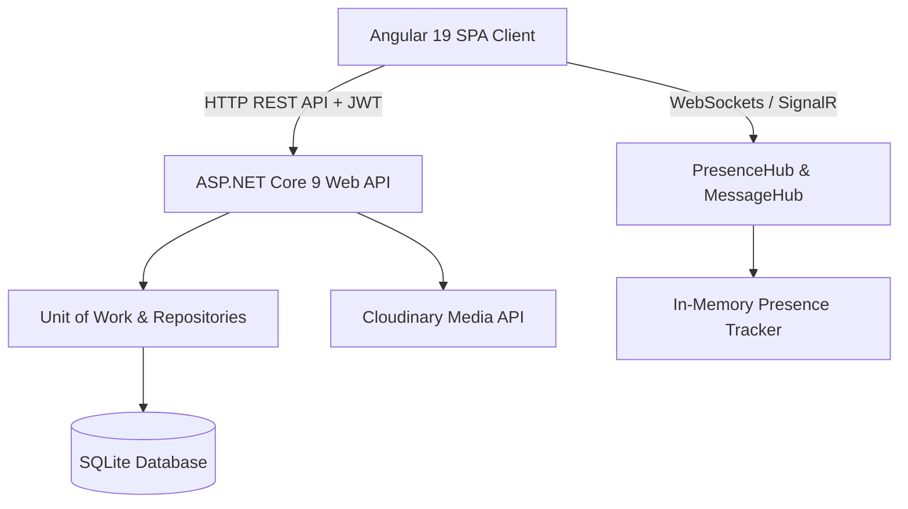

# 💖 DatingApp — Full-Stack Dating & Realtime Chat Application

[](https://github.com/ParthDev787/DatingApp)
[](https://dotnet.microsoft.com/)
[](https://angular.dev/)
[](https://dotnet.microsoft.com/apps/aspnet/signalr)
[](https://daisyui.com/)

A modern, production-ready, full-stack Dating and Real-Time Chat web application built with **ASP.NET Core 9 Web API** and **Angular 19**. Features secure authentication, real-time messaging, online presence tracking, photo moderation, role-based access control (Admin, Moderator, Member), and full-text filtering.

---

## 📑 Table of Contents

- [🚀 Key Features](#-key-features)
- [🛠️ Tech Stack](#️-tech-stack)
- [🏗️ Architecture & Design Patterns](#️-architecture--design-patterns)
- [📦 Project Structure](#-project-structure)
- [⚙️ Getting Started](#️-getting-started)
  - [Prerequisites](#prerequisites)
  - [Backend Configuration](#backend-configuration)
  - [Frontend Configuration](#frontend-configuration)
- [🔑 Seed Accounts](#-seed-accounts)
- [📋 Completed Course Curriculum (Sections 1–19)](#-completed-course-curriculum-sections-119)
- [🧑‍💻 Author](#-author)

---

## 🚀 Key Features

### 🔐 Authentication & Identity
- **ASP.NET Core Identity** with role management (`Admin`, `Moderator`, `Member`).
- **JWT Authentication** + **Refresh Token rotation** via secure, `HttpOnly`, `SameSite=None` cookies.
- **Route Guards**: `authGuard`, `adminGuard`, and `preventUnsavedChangesGuard`.
- Role-based UI rendering with custom Angular `*appHasRole` directive and reactive signals.

### 💬 Real-Time Messaging & Presence (SignalR)
- **PresenceHub**: Real-time tracking of online/offline users across browser tabs.
- **MessageHub**: Direct instant messaging with message grouping, live delivery, and read receipts.
- Live toast notifications when receiving messages while browsing other profiles.

### 👤 Profile & Photo Management
- Multi-photo gallery upload powered by **Cloudinary**.
- Main photo selection and deletion.
- **Admin Photo Moderation**: Photos require Moderator/Admin approval before becoming publicly visible.
- Photo unapproved query filter applied at the repository query level.

### ❤️ Likes & Match System
- Like and unlike member profiles.
- Filter lists by *"Members I like"*, *"Members who like me"*, or mutual *"Matches"*.

### 🔍 Member Filtering & Pagination
- Server-side pagination with custom HTTP response headers.
- Filter members by gender, min/max age range, and order by `lastActive` or `created`.

### 🎨 Modern UI & Experience
- Fully responsive UI styled with **TailwindCSS** and **DaisyUI 5**.
- Multiple theme switcher (Light, Dark, Cupcake, Synthwave, Cyberpunk, etc.).
- Custom loading spinner interceptor with cache management.
- Reusable confirmation modal dialogs.

---

## 🛠️ Tech Stack

### Backend
- **Framework**: ASP.NET Core 9.0 Web API
- **ORM & Data**: Entity Framework Core 9.0 (SQLite Database)
- **Identity & Security**: Microsoft.AspNetCore.Identity, System.IdentityModel.Tokens.Jwt
- **Real-Time Communication**: Microsoft.AspNetCore.SignalR
- **Cloud Storage**: CloudinaryDotNet
- **Patterns**: Repository Pattern & Unit of Work (`IUnitOfWork`)

### Frontend
- **Framework**: Angular 19 (Standalone Components, Signals, View Transitions)
- **Styling**: Tailwind CSS, DaisyUI 5
- **Icons & UI**: Heroicons, Custom Modal Services
- **Reactive Programming**: RxJS, Angular Signals (`signal`, `computed`)
- **HTTP**: Functional Interceptors (`errorInterceptor`, `jwtInterceptor`, `loadingInterceptor`)

---

## 🏗️ Architecture & Design Patterns



- **Unit of Work Pattern**: Bundles database changes in `UserRepository`, `LikesRepository`, `MessageRepository`, and `PhotoRepository` into single atomic transactions.
- **Action Filters**: `LogUserActivity` automatically tracks user activity timestamp on API interaction.
- **SignalR Hub Connections**: Managed automatically with Angular lifecycle hooks and reactive presence tracking.

---

## ⚙️ Getting Started

### Prerequisites
- [.NET 9.0 SDK](https://dotnet.microsoft.com/download/dotnet/9.0)
- [Node.js (v20+ or v22+)](https://nodejs.org/)
- [Angular CLI](https://angular.dev/tools/cli): `npm install -g @angular/cli`

### Backend Setup

1. Navigate to the API folder:
   ```bash
   cd API
   ```
2. Create your `appsettings.Development.json` (copy from `appsettings.Example.json`):
   ```json
   {
     "Logging": {
       "LogLevel": {
         "Default": "Information",
         "Microsoft.AspNetCore": "Warning"
       }
     },
     "ConnectionStrings": {
       "DefaultConnection": "Data Source=datingapp.db"
     },
     "TokenKey": "super secret key super secret key super secret key super secret key",
     "CloudinarySettings": {
       "CloudName": "YOUR_CLOUD_NAME",
       "ApiKey": "YOUR_API_KEY",
       "ApiSecret": "YOUR_API_SECRET"
     }
   }
   ```
3. Run migrations and start the backend:
   ```bash
   dotnet watch
   ```
   *The API will start at `https://localhost:5001` and seed test users automatically.*

### Frontend Setup

1. Navigate to the Client folder:
   ```bash
   cd Client
   ```
2. Install dependencies:
   ```bash
   npm install
   ```
3. Run the development server:
   ```bash
   ng serve
   ```
   *Open `http://localhost:4200` in your browser.*

---

## 🔑 Seed Accounts

All test accounts are seeded with password: `Pa$$w0rd`

| Account Email | Role(s) | Description |
|---|---|---|
| `admin@test.com` | `Admin`, `Moderator` | Access to Photo Moderation and User Role Management |
| `lisa@test.com` | `Member` | Female test dating profile |
| `todd@test.com` | `Member` | Male test dating profile |

---

## 📋 Completed Course Curriculum (Sections 1–19)

- ✅ **Section 1**: Introduction & Overview
- ✅ **Section 2**: Building a Walking Skeleton (.NET API & Angular Client)
- ✅ **Section 3**: Adding Authentication (JWT & Password Hashing)
- ✅ **Section 4**: Client Authentication & Route Guards
- ✅ **Section 5**: Error Handling (Global Middleware & Interceptors)
- ✅ **Section 6**: Entity Framework Core & Repository Pattern
- ✅ **Section 7**: Angular Routing & UI Components
- ✅ **Section 8**: Photo Upload & Cloudinary Integration
- ✅ **Section 9**: Reactive Forms & Form Validation
- ✅ **Section 10**: Paging, Sorting & Filtering
- ✅ **Section 11**: Likes Feature & Match Filtering
- ✅ **Section 12**: Messaging System & Conversation Threads
- ✅ **Section 13**: Identity Core & Role-Based Authorization
- ✅ **Section 14**: SignalR Real-Time Online Presence
- ✅ **Section 15**: SignalR Real-Time Direct Messaging
- ✅ **Section 16**: Refresh Token Rotation & HttpOnly Cookies
- ✅ **Section 17**: Unit of Work Pattern & Connection Optimization
- ✅ **Section 18**: Photo Approval & Moderation Workflow
- ✅ **Section 19**: Query Filters, Custom UI Modals & Final Polish

---

## 🧑‍💻 Author

**Parth**
- GitHub: [@ParthDev787](https://github.com/ParthDev787)
